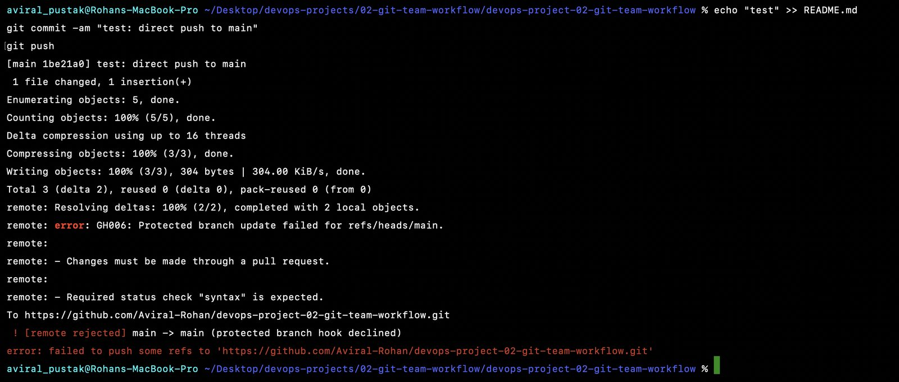
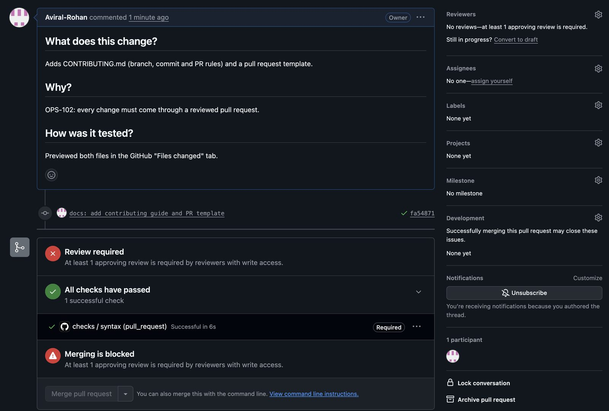
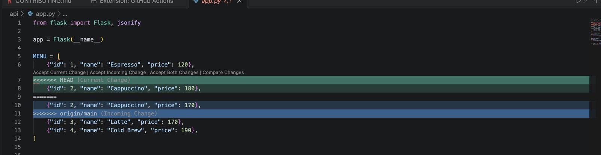
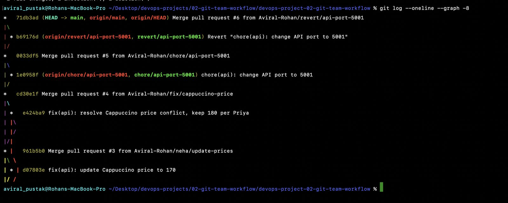
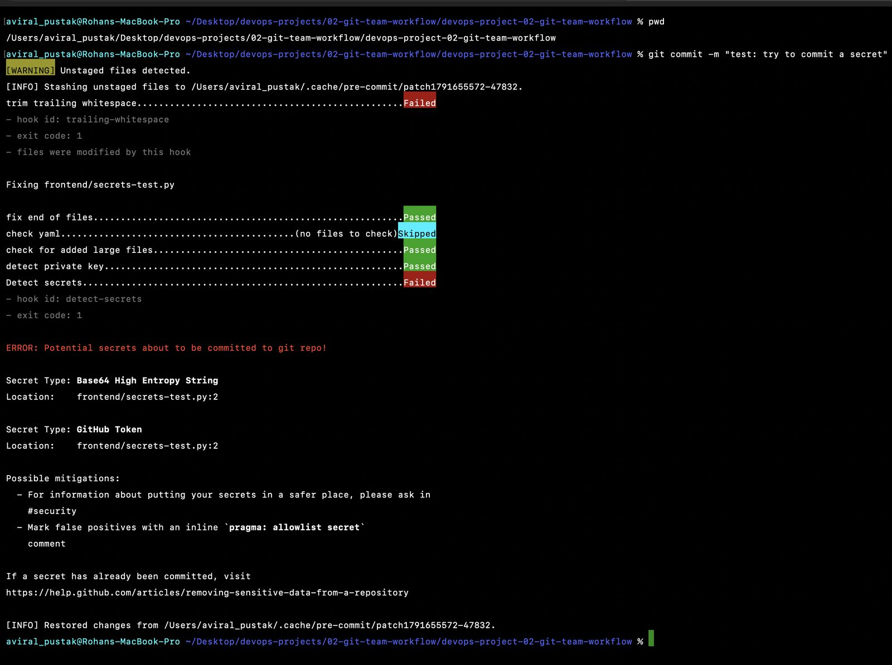

# Project 02: Git the Way Teams Use It

**Real-World DevOps Projects** · Part 2 of 20 · Rohan Aviral

> **Ticket OPS-102 from Arjun (Senior DevOps).** From now on nobody pushes to `main`. Set up the repo so that `main` is protected, every change comes through a pull request, and we can tell from the history what was released when.

This repo is **BrewCart**, a small coffee-ordering app (Flask menu API + Express frontend), run the way a team runs it: protected `main`, feature branches, pull requests with a template, Conventional Commits, a real merge conflict, a safe revert, pre-commit hooks that block secrets, and a tagged release.

📄 Full step-by-step write-up with screenshots: **[Project_02_Git_Team_Workflow.pdf](https://github.com/Aviral-Rohan/devops-project-02-git-team-workflow/releases/download/v1.0.0/Project_02_Git_Team_Workflow.pdf)** (attached to the v1.0.0 release)
🏷️ Release: [v1.0.0: Team Git workflow](https://github.com/Aviral-Rohan/devops-project-02-git-team-workflow/releases/tag/v1.0.0)
⬅️ Previous: [Project 01, Linux Ops Toolkit](https://github.com/Aviral-Rohan/devops-project-01-linux-ops-toolkit) · ➡️ Next: Project 03, Docker

---

## In plain words

Think of `main` as the final copy of a shared document that customers read. Before this project, anyone could type straight into it. Now:

- **`main` is locked.** Every change is a draft (a *branch*) that goes through a review request (a *pull request*).
- **A robot checks every draft** (GitHub Actions `syntax` check) before it can be merged.
- **Clashing edits** (a *merge conflict*) are settled by a person who checks with the decision owner.
- **Mistakes that reach `main` get a correction**, not an eraser (`git revert`, not `git reset`).
- **A guard at the door** (a *pre-commit hook*) blocks passwords and tokens before they are ever committed.
- **Every release gets a bookmark** (a *tag*, `v1.0.0`) and a public notice (a *GitHub Release*).

## What's inside

```
devops-project-02-git-team-workflow/
├── api/app.py                         # Flask menu API (port 5000)
├── frontend/server.js                 # Express frontend (port 3000)
├── .github/
│   ├── workflows/checks.yml           # required "syntax" check on every PR
│   └── pull_request_template.md       # What / Why / How tested / checklist
├── .pre-commit-config.yaml            # whitespace, EOF, YAML, large files, private keys, detect-secrets
├── CONTRIBUTING.md                    # branch names, Conventional Commits, PR flow, releases
└── docs/
    ├── git-cheatsheet.md              # every command used in this project, explained
    └── screenshots/                   # evidence, in order
```

## Branch protection on `main`

| Setting | Value |
|---|---|
| Require a pull request before merging | On |
| Required approvals | 0 (one-person repo; raise to 1 when a second reviewer joins) |
| Require status checks to pass | On: `syntax` |
| Require branches to be up to date | On |
| Do not allow bypassing (applies to admins too) | On |

A direct push is rejected with `GH006: Protected branch update failed`:



**Decision record.** With one approval required, PR #1 was blocked: GitHub never lets authors approve their own pull requests. In a team, the author asks for a review and moves on to the next ticket. For this one-person repo the approval count was set to 0, while the PR requirement, the required check and "no bypass" stayed on.



## Pull request history

| PR | Branch | What happened |
|---|---|---|
| #1 | `docs/contributing` | CONTRIBUTING.md and PR template. Blocked until the approval rule was adjusted. |
| #2 | `feature/add-cold-brew` | First PR with the auto-filled template |
| #3 | `neha/update-prices` | Neha sets Cappuccino to ₹170 (merged first) |
| #4 | `fix/cappuccino-price` | Conflict with #3 on the same line; resolved locally, ₹180 kept per Priya |
| #5 | `chore/api-port-5001` | API moved to port 5001, which broke the frontend |
| #6 | `revert/api-port-5001` | `git revert` of #5: history keeps both the mistake and the correction |
| #7 | `feature/add-mocha` | Three WIP commits squashed into one with `git rebase -i` |
| #8 | `feature/menu-heading` | One good commit taken from an experiment branch with `git cherry-pick` |
| #9 | `chore/pre-commit-hooks` | Pre-commit hooks, including secret scanning |

Tag **`v1.0.0`** marks the state after PR #9.

## The incidents

### 1. Merge conflict: two prices for one coffee

Neha's branch (₹170) merged first; mine (₹180) then conflicted on the same line. I merged `origin/main` into my branch, checked with the decision owner, kept ₹180, removed the markers, committed, and let CI re-run before merging.

```
<<<<<<< HEAD
    {"id": 2, "name": "Cappuccino", "price": 180},
=======
    {"id": 2, "name": "Cappuccino", "price": 170},
>>>>>>> origin/main
```



### 2. A bad change on `main`: revert, don't reset

PR #5 moved the API to port 5001 while the frontend still called 5000. The change was already shared, so `git reset` (which rewrites history) was off the table. `git revert --no-edit <hash>` created an undo commit, which went through its own PR (#6).



### 3. A secret on its way into a commit

A test file with a **fake** GitHub-format token was staged and committed. The hook blocked it:



## Pre-commit hooks

```bash
python3 -m pip install --user pre-commit
pre-commit install            # once per clone
pre-commit run --all-files    # check everything now
```

| Hook | What it does |
|---|---|
| `trailing-whitespace` | Removes spaces at line ends (auto-fix) |
| `end-of-file-fixer` | Every file ends with exactly one newline (auto-fix) |
| `check-yaml` | Blocks invalid YAML |
| `check-added-large-files` | Blocks files over 500 KB (why the write-up PDF is a release asset, not a repo file) |
| `detect-private-key` | Blocks SSH/TLS private keys |
| `detect-secrets` | Blocks tokens, API keys and high-entropy strings |

Local hooks can be skipped with `--no-verify`, so the next step is to run the same hooks in CI.

## Problems I hit

| Problem | Cause | Fix |
|---|---|---|
| `Invalid username or token` on first push | Expired token saved in the macOS Keychain | Removed it with `git credential reject`, created a new token (`repo` + `workflow` scopes) |
| A real token visible in a screenshot and shell history | Pasted at the wrong prompt | Revoked and replaced the token, cropped the screenshot, removed it from `~/.zsh_history` |
| `pathspec did not match` | PR template saved in `.github/workflows/` | Moved it to `.github/` |
| "Already up to date" instead of a conflict | Neha's branch was pushed but not merged | Merged her PR first, then merged `origin/main` into mine |
| `cannot 'squash' without a previous commit` | All three lines set to `squash` | `git rebase --abort`; first line `pick`, the rest `squash` |
| Cherry-picked commit dropped a `<ul>` tag | Accidental edit inside the "good" commit | Fixed and `git commit --amend` before it was pushed |
| `.pre-commit-config.yaml` not found | File created inside `frontend/` | Moved it to the repo root |

## What I learned

- Protect `main` and let rules, not memory, enforce the process.
- A merge conflict is a question for a person. Answer it with the decision owner, then let CI re-run.
- `revert` for shared history, `reset` and `--amend` only for commits nobody else has.
- Squash work-in-progress commits before review; cherry-pick when you need one commit, not a branch.
- Catch secrets on the developer's machine, and assume a leaked token is compromised: revoke first.
- Tag releases with annotated SemVer tags so "what shipped when" has an exact answer.

## Run the app (optional)

```bash
cd api && python3 -m venv .venv && .venv/bin/pip install -r requirements.txt && .venv/bin/python app.py
cd frontend && npm install && npm start        # http://localhost:3000
```

## License

MIT. BrewCart and the team members named here are fictional, for training.
